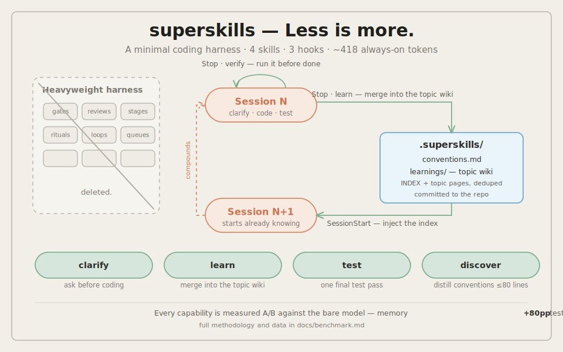

# superskills

**Less is more.** 极简 Coding Harness，以 Claude Code 与 Codex 双官方 plugin 形式交付：4 个 skill、3 个 hook、常驻成本约 418 token。Aone Copilot 由安装脚本覆盖。

<p align="center"></p>

[English](README.en.md)

## 为什么

重型 harness 在模型需要步步设防的年代是合理的：硬性流程门控、多阶段审查、强制 TDD 循环。随着模型能力增强，这些脚手架大多变成了负担。真正能持续产生复利的只有四件事：

1. **记忆** — 历史会话中的经验（纠正、踩坑、决策），任何模型都无法从代码中推断出来
2. **规范** — 一份精简、有据可查的项目实际约定
3. **澄清** — 写代码之前解决需求中真正悬而未决的部分
4. **收尾测试** — 验证行为正确，且不把过程仪式化

superskills 只保留这四件事，删掉其余一切。

## 它真的有效吗

同任务、同模型（Sonnet 4.6）、真实端到端运行、确定性程序评分的 A/B 对照测量，完整方法学与分项数据见 [docs/benchmark.md](docs/benchmark.md)：

| 场景 | 基线（纯模型） | 带 superskills | Δ |
|------|--------------|----------------|---|
| 跨会话记忆（3 条团队决策沉淀为 learnings） | 20% | 100% | **+80pp** |
| 需求澄清（刻意模糊的功能请求） | 0% 提问 | 67% 提问 | **+67pp** |
| 收尾测试（"刚开发完"的代码埋了 2 个 bug） | 40%，测试把 bug 锁死 | 100%，两个 bug 均根因修复 | **+60pp** |
| 规范遵循（规则散落在文档里） | 100% | 100% | 0pp，耗时相近 |
| 控制组：HumanEval/0–9 原题 | 10/10 | 10/10 | **无回归** |

规律很清晰：当知识在一个十文件的小项目里一眼可见时，强模型本来就守规矩（S1、控制组）。增益恰好出现在 superskills 的工作域上——仓库里根本不存在的知识（记忆）、没人问过的问题（澄清）、以及新写的测试会欣然固化下来的 bug（收尾测试）。基线在三轮中全部围着两个埋好的 bug 写出了绿色测试套件；test skill 三轮全部把两个 bug 在生产代码层面根因修复。

## 包含什么

| 组件 | 类型 | 作用 |
|------|------|------|
| `superskills:discover` | skill | 扫描存量项目，生成极简规范文件：`.superskills/conventions.md`（不超过 80 行）、`AGENTS.md`、`CLAUDE.md`；过期时刷新，并把已固化的 learnings 折叠进规范 |
| `superskills:learn` | skill | 把值得长期保留的经验（用户纠正、踩坑与修复、代码中看不出的决策）沉淀到 `.superskills/learnings/` |
| `superskills:clarify` | skill | 只提出会改变实现方案的问题，每个问题附推荐答案，澄清完立即开始编码 |
| `superskills:test` | skill | 开发结束后组织一次完整的单元测试，只看结果，不固定流程 |
| SessionStart hook | hook | 每次会话注入 learnings 索引；规范落后 HEAD 超过 30 个提交时提醒刷新；项目缺少 AI 规范文件时建议运行 discover |
| Stop hook（verify） | hook | 完成前验证：若会话改了代码却从未执行过，阻止收尾一次并要求真实运行——文档示例加边界用例——按根因修复 |
| Stop hook（learn） | hook | 自动总结：当会话做了实际工作（用户消息不少于 5 条且有文件修改）时，在结束前让模型带着完整上下文判断一次是否有值得沉淀的内容 |

所有组件都会出现在 `/plugin` 面板中，并标注各自的 token 成本。常驻总成本约 418 token。

### 项目内产物（提交到仓库）

```
.superskills/
├── conventions.md        # 唯一事实源，不超过 80 行
└── learnings/
    ├── INDEX.md          # 每条经验一行，会话开始时自动注入
    └── 2026-06-12-use-pnpm.md
AGENTS.md                 # 不超过 20 行，指向 .superskills/
CLAUDE.md                 # @AGENTS.md + @.superskills/conventions.md
```

## 安装

### Claude Code（plugin，推荐）

```
/plugin marketplace add Mrlyk/superskills
/plugin install superskills@superskills
```

也可以用 CLI：`claude plugin marketplace add Mrlyk/superskills && claude plugin install superskills@superskills`。hooks 随插件自动注册，不会改动你的 `settings.json`。

### Codex（plugin）

```bash
git clone https://github.com/Mrlyk/superskills.git
codex plugin marketplace add ./superskills
codex plugin add superskills@superskills
```

或在克隆目录内运行 `./install.sh`（检测到支持 plugin 的 codex CLI 时自动走相同流程，老版本 CLI 自动回退为自定义 prompts）。注意保留克隆目录，Codex 从该目录解析插件。

### Aone Copilot

```bash
git clone https://github.com/Mrlyk/superskills.git && cd superskills
./install.sh              # 自动检测 ~/.aone_copilot（与 ~/.codex）
```

### 项目级安装（不影响用户全局）

上面的方式都是用户级（对所有项目生效）。只想在某个项目里启用、不动用户全局配置时，用项目级安装。

Claude Code 官方支持安装作用域，在项目目录内执行：

```
/plugin marketplace add Mrlyk/superskills --scope project
/plugin install superskills@superskills --scope project
```

这只会写入项目的 `.claude/settings.json`（`extraKnownMarketplaces` + `enabledPlugins` 两个条目），用户级配置零改动。把这个文件提交后，队友打开项目时 Claude Code 会自动提示安装并启用。只想自己用、不进版本库的话，把 `--scope project` 换成 `--scope local`（写入 `.claude/settings.local.json`）。

也可以不依赖 claude CLI，用安装脚本一键完成（同时覆盖 Aone Copilot 的项目级安装）：

```bash
./install.sh --project /path/to/your-project    # 省略路径则为当前目录
./install.sh --project /path/to/your-project --uninstall
```

它写入项目的 `.claude/settings.json`（与官方 `--scope project` 产物完全一致），并把 skills 和 hooks 复制进项目的 `.aone_copilot/`（hook 路径通过 `$CLAUDE_PROJECT_DIR` 解析，提交后全队可用）。Codex 的 plugin 配置只有全局一档，没有项目作用域；Codex 的项目级覆盖本来就由 `AGENTS.md` 指引 + `.superskills/` 承担（运行 discover 即可）。

| 工具 | Skills | Hooks（自动总结 + 注入） | 项目级安装 |
|------|--------|------|------|
| Claude Code | plugin：`superskills:discover` 等 | 支持 | `--scope project/local` 或 `install.sh --project` |
| Codex | plugin：`superskills:discover` 等 | 不支持（Codex plugin 无 hook 机制），自动总结改用手动 learn | 无 plugin 项目作用域，靠 `AGENTS.md` + `.superskills/` |
| Aone Copilot | `~/.aone_copilot/skills/ss-*` | 支持 | `install.sh --project`（产物进 `.aone_copilot/`） |

无法访问 marketplace 的环境可用 `./install.sh --tools claude` 做传统 settings 安装。`--uninstall` 可完整卸载并保留你自己的配置。

安装后，在每个项目里运行一次 discover skill，把生成的文件提交即可。所有沉淀（`.superskills/` 规范与 learnings）始终写在项目仓库根目录，属于项目级记忆，与安装方式无关。

## 沉淀的知识如何被利用

两条通道，保证核心机制在没有 hook 的工具里也能工作：

- **规范**走文件引用：Claude Code 和 Aone Copilot 通过 `CLAUDE.md` 的 import 加载；Codex 通过 `AGENTS.md` 中的指引读取。零 hook 依赖，所有工具通用。
- **Learnings**走 SessionStart hook 注入索引（Claude Code / Aone Copilot）；Codex 无 hook 机制，由 `AGENTS.md` 中的指引引导模型查阅索引。模型看到的只有每条一行的索引，相关时才打开完整条目——历史知识的成本是几百个 token，而非几千。

已经固化为稳定规则的 learnings，会在 discover 的刷新模式中被折叠进 `conventions.md`，知识库不会无限膨胀。

## 自动总结的设计

与基于观察的方案（PreToolUse/PostToolUse 全量捕获加后台分析进程）相比，superskills 把判断挪到了唯一既便宜又可靠的时机：会话结束。Stop hook 是一个约 100 行的过滤器，只判断这个会话*值不值得*总结（消息够多、确实改了文件、每个会话只触发一次、绝不循环）；而*总结什么*交给模型——它本来就持有完整会话上下文，并且被明确允许"无可沉淀就什么都不写"。没有观察文件、没有后台进程、没有逐工具调用的开销。产出直接落在项目仓库里，整个团队共享。

## 测试

```bash
tests/run.sh              # hook + 安装脚本 + plugin 结构测试（不调用模型）
tests/run.sh --bench      # 追加冒烟基准（真实 claude -p 运行）
tests/bench/run.sh        # 完整 A/B 能力基准（约 44 次模型运行）
```

## License

MIT。基准控制组内置了 HumanEval 题目（MIT，OpenAI），见 [tests/bench/humaneval/ATTRIBUTION.md](tests/bench/humaneval/ATTRIBUTION.md)。
